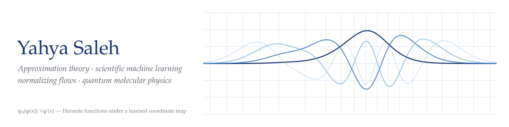

<!--
  This file is GENERATED by saleh0694.github.io/bin/build.py from
  _data/cv.yml and _bibliography/papers.bib. Do not edit it here:
  edit the data in the website repo; this README refreshes itself daily
  (or run the "Update README" workflow in this repo by hand).
-->
<picture>
  <source media="(prefers-color-scheme: dark)" srcset="assets/banner-dark.svg">
  
</picture>

  
  
  
  
  
  

Hey, I'm Yahya, an applied mathematician and research engineer. I have
experience in building and analyzing machine learning models for scientific
computing and engineering problems. 

I am genuinely passionate about pushing the boundaries of what is machine
computable. I developed a new spectral-learning framework
for solving Schrödinger equations that describe vibrations of molecules and
built software that eases the adoption of this framework in practical
applications (not that the framework is widely adopted but getting there :v).

In more industrial applications, I've built test automation and data-fixture
tooling for banking systems, prototyped AI-agent integrations with the Model
Context Protocol (MCP), and worked on cloud deployment of machine learning models.

### Selected publications

- **Inducing Riesz Bases in L² via Composition Operators** 
  **Y. Saleh**, A. Iske · *Complex Analysis and Operator Theory* 20 (2026) · [paper](https://doi.org/10.1007/s11785-025-01874-5) · [arXiv](https://arxiv.org/abs/2406.18613)
- **Convergence theory for Hermite approximations under adaptive coordinate transformations** 
  **Y. Saleh** · *arXiv preprint* (2026) · [arXiv](https://arxiv.org/abs/2604.16975)
- **Computing Excited States of Molecules Using Normalizing Flows** 
  **Y. Saleh**, Á. F. Corral, E. Vogt, A. Iske, J. Küpper, A. Yachmenev · *Journal of Chemical Theory and Computation* 21 (2025) · [paper](https://doi.org/10.1021/acs.jctc.5c00590) · [arXiv](https://arxiv.org/abs/2308.16468)
- **Bounds on the Generalization Error in Active Learning** 
  V. Menden, **Y. Saleh**, A. Iske · *Proceedings of the 6th Northern Lights Deep Learning Conference (NLDL)* 265 (2025) · [paper](https://proceedings.mlr.press/v265/menden25a.html) · [arXiv](https://arxiv.org/abs/2409.09078)
- **Active learning of potential-energy surfaces of weakly bound complexes with regression-tree ensembles** 
  **Y. Saleh**, V. Sanjay, A. Iske, A. Yachmenev, J. Küpper · *The Journal of Chemical Physics* 155 (2021) · [paper](https://doi.org/10.1063/5.0057051) · [code](https://github.com/CFEL-CMI/Active-Learning-of-PES)

<b>All 11 publications</b>

 

1. E. Vogt, Á. F. Corral, **Y. Saleh**, *Adaptive Vibrational Coordinates via Symmetry-Aware Normalizing Flows*, Journal of Chemical Theory and Computation **22**, 6137 (2026) · [link](https://doi.org/10.1021/acs.jctc.6c00224)
2. **Y. Saleh**, A. Iske, *Inducing Riesz Bases in L² via Composition Operators*, Complex Analysis and Operator Theory **20**, 21 (2026) · [link](https://doi.org/10.1007/s11785-025-01874-5)
3. **Y. Saleh**, *Convergence theory for Hermite approximations under adaptive coordinate transformations*, arXiv:2604.16975 (2026) · [link](https://arxiv.org/abs/2604.16975)
4. A. Yachmenev, E. Vogt, Á. F. Corral, **Y. Saleh**, *Taylor-mode automatic differentiation for constructing molecular rovibrational Hamiltonian operators*, The Journal of Chemical Physics **163**, 072501 (2025) · [link](https://doi.org/10.1063/5.0287347)
5. E. Vogt, Á. F. Corral, **Y. Saleh**, A. Yachmenev, *Transferability and interpretability of vibrational normalizing-flow coordinates*, The Journal of Chemical Physics **163**, 154106 (2025) · [link](https://doi.org/10.1063/5.0285954)
6. **Y. Saleh**, Á. F. Corral, E. Vogt, A. Iske, J. Küpper, A. Yachmenev, *Computing Excited States of Molecules Using Normalizing Flows*, Journal of Chemical Theory and Computation **21**, 5221–5229 (2025) · [link](https://doi.org/10.1021/acs.jctc.5c00590)
7. V. Menden, **Y. Saleh**, A. Iske, *Bounds on the Generalization Error in Active Learning*, Proceedings of the 6th Northern Lights Deep Learning Conference (NLDL) **265**, 168–175 (2025) · [link](https://proceedings.mlr.press/v265/menden25a.html)
8. Á. F. Corral, **Y. Saleh**, *Enhancing polynomial approximation of continuous functions by composition with homeomorphisms*, arXiv:2512.13740 (2025) · [link](https://arxiv.org/abs/2512.13740)
9. T. Wenzel, **Y. Saleh**, A. Iske, *Two-Layered and Deep Kernels as Data-Adapted Kernels*, DEEPK 2024: International Workshop on Deep Learning and Kernel Machines (2024) · [link](https://www.esat.kuleuven.be/stadius/E/DEEPK2024/7_two_layered_and_deep_kernels_a.pdf)
10. **Y. Saleh**, A. Iske, A. Yachmenev, J. Küpper, *Augmenting Basis Sets by Normalizing Flows*, Proceedings in Applied Mathematics and Mechanics **23**, e202200239 (2023) · [link](https://doi.org/10.1002/pamm.202200239)
11. **Y. Saleh**, V. Sanjay, A. Iske, A. Yachmenev, J. Küpper, *Active learning of potential-energy surfaces of weakly bound complexes with regression-tree ensembles*, The Journal of Chemical Physics **155**, 144109 (2021) · [link](https://doi.org/10.1063/5.0057051)

### Software

| | |
|---|---|
| [**Active-Learning-of-PES**](https://github.com/CFEL-CMI/Active-Learning-of-PES) | Active learning of potential-energy surfaces with regression-tree ensembles |
| [**FlowBasis**](https://github.com/CFEL-CMI/FlowBasis) | Spectral learning — basis sets augmented by normalizing flows for solving differential equations |
| [**vibrojet**](https://github.com/robochimps/vibrojet) | Molecular rovibrational kinetic and potential-energy operators via Taylor-mode automatic differentiation |

### Recent talks

- 2026 · *Learning, sharing, and using optimized vibrational coordinates* — ExoMol 2026, University College London, United Kingdom (invited)
- 2026 · *Learning bases via normalizing flows, applications to solving molecular Schrödinger equations and image compression* — International Conference on Scientific Computing and Machine Learning, Bath, United Kingdom
- 2025 · *Normalizing flows: from learning probability distributions to basis-set discovery* — Linköping University, Sweden (invited)
- 2025 · *Learning basis sets using unitary and bounded bijective operators* — International Conference in Numerical Mathematics and Scientific Computing, Uppsala University, Sweden
- 2025 · *Bounds on the generalization error in active learning* — 6th Northern Lights Deep Learning Conference (NLDL), Tromsø, Norway (poster)

20 talks and posters in total, 6 of them invited — [full list](https://saleh0694.github.io/talks/).

This profile is generated from the same data as my [website](https://saleh0694.github.io) and [CV](https://saleh0694.github.io/assets/pdf/cv.pdf).
